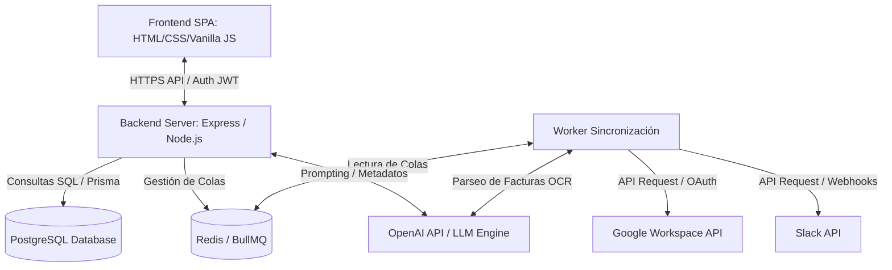

# Arquitectura General: Onniik

El sistema utiliza una arquitectura web desacoplada de 3 capas: Presentación (Frontend SPA), Negocio (Backend API + Workers) y Datos (Base de Datos + Caché / Colas).

## Diagrama de Flujo y Componentes



## Flujo de Datos para Detección de Ahorros
1. **Conexión**: El usuario concede permisos OAuth de Google Workspace / Slack.
2. **Sincronización Asíncrona**: El Backend encola una tarea de sincronización en Redis.
3. **Extracción**: El Worker extrae los logs de uso y los correos de facturas.
4. **Enriquecimiento por IA**: Las facturas PDF se procesan mediante OCR e IA (OpenAI) para extraer el monto exacto, la moneda y el proveedor.
5. **Detección**: El motor de reglas evalúa si hay inactividad o duplicidad de herramientas.
6. **Alerta**: Se registra una recomendación en PostgreSQL y se actualiza el Dashboard del usuario en tiempo real.

## Modelo de Datos Principal (Prisma Schema DSL Conceptual)
```prisma
model User {
  id             String        @id @default(uuid())
  email          String        @unique
  passwordHash   String?       // Opcional/Nulo en el MVP (Inicio de sesión exclusivo con Google SSO)
  role           String        // ADMIN, IT_MANAGER, READER
  organizationId String
  organization   Organization  @relation(fields: [organizationId], references: [id])
  createdAt      DateTime      @default(now())
}

model Organization {
  id            String             @id @default(uuid())
  name          String
  subscriptions SaaSSubscription[]
  users         User[]
  integrations  OAuthCredential[]
}

model SaaSSubscription {
  id             String             @id @default(uuid())
  organizationId String
  organization   Organization       @relation(fields: [organizationId], references: [id])
  name           String
  cost           Float
  billingCycle   String             // MONTHLY, ANNUALLY
  status         String             // ACTIVE, INACTIVE, OPTIMIZABLE
  usersCount     Int
  lastSyncedAt   DateTime           @default(now())
  recommendation OptimizationRecommendation?
}

model OptimizationRecommendation {
  id             String           @id @default(uuid())
  subscriptionId String           @unique
  subscription   SaaSSubscription @relation(fields: [subscriptionId], references: [id])
  type           String           // UNUSED_SEAT, DUPLICATE_TOOL, SHADOW_IT
  suggestedAction String          // DOWNSIDE, CANCEL, NEGO
  potentialSaving Float
  emailDraft     String?
  status         String           // PENDING, APPLIED, IGNORED
}

model OAuthCredential {
  id             String       @id @default(uuid())
  organizationId String
  organization   Organization @relation(fields: [organizationId], references: [id])
  provider       String       // GOOGLE, SLACK
  accessToken    String
  refreshToken   String
  expiresAt      DateTime
}
```
