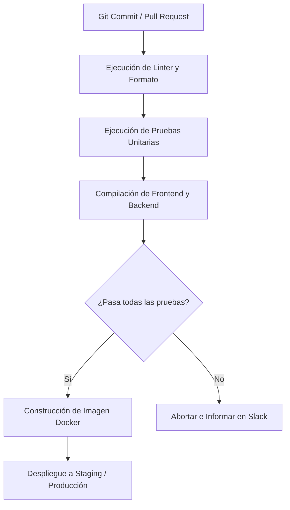

# Plan de Despliegue e Infraestructura

El despliegue de Onniik está automatizado mediante flujos de integración y entrega continuas (CI/CD) para mitigar errores humanos y garantizar disponibilidad.

---

## 1. Entornos de Ejecución

### Entorno de Staging (Pruebas de Calidad)
- **Infraestructura**: Desplegado en servicios PaaS (ej. Render, Railway o AWS App Runner).
- **Base de Datos**: PostgreSQL gestionado con tamaño de almacenamiento mínimo.
- **Acceso**: Restringido al equipo de desarrollo y usuarios beta internos.

### Entorno de Producción (Clientes Finales)
- **Infraestructura**: Clúster de contenedores Docker autogestionado con escalado automático de instancias.
- **Base de Datos**: Instancia de base de datos relacional PostgreSQL con alta disponibilidad (Multi-AZ) y copias de seguridad diarias automatizadas.
- **CDN**: Cloudflare para caché de archivos estáticos en el frontend y protección contra ataques DDoS.

---

## 2. Pipeline de CI/CD (GitHub Actions)

El flujo de despliegue automatizado se ejecuta al realizar fusiones (merge) en las ramas principales:

## 3. Estrategia de Despliegue sin Tiempo de Inactividad (Zero-Downtime)
- Se utiliza una estrategia de **Rolling Update** o despliegue **Blue-Green**.
- Los nuevos contenedores se inicializan y verifican mediante la ruta de salud `/api/v1/health` antes de desviar el tráfico de red de los contenedores antiguos, garantizando cero caídas del servicio durante actualizaciones.
