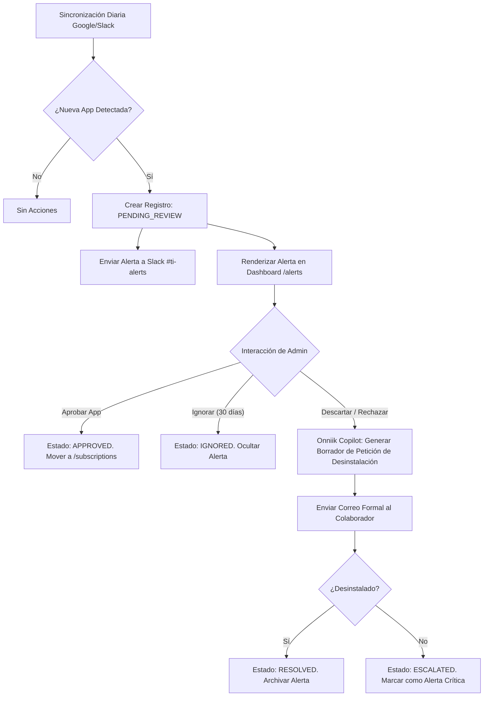

# Flujo de Usuario: Detección y Resolución de Shadow IT

Este documento especifica el recorrido interactivo de un administrador de TI o CFO dentro de Onniik al identificar y mitigar aplicaciones de software no autorizadas (*Shadow IT*) instaladas por los empleados en la organización.

---

## 1. Diagrama de Flujo del Proceso

El flujo cubre desde la detección pasiva nocturna hasta las acciones correctivas:



---

## 2. Estados Lógicos en Base de Datos (`SaaSApplicationStatus`)

Para gestionar el ciclo de vida de una herramienta detectada en el motor de Shadow IT, la tabla conceptual mapea las siguientes enumeraciones:
*   `PENDING_REVIEW`: Software nuevo detectado que aún no ha sido clasificado por el administrador.
*   `APPROVED`: Software aprobado oficialmente. Deja de emitir alertas de Shadow IT y se integra al catálogo activo en la ruta `/subscriptions`.
*   `IGNORED`: Software de bajo impacto que se silencia temporalmente (por un plazo configurable de 30 días) para evitar saturación de notificaciones.
*   `DISMISSED`: Software rechazado por políticas de TI/Finanzas. Requiere desinstalación obligatoria.
*   `RESOLVED`: Software desinstalado exitosamente por el empleado. La alerta se archiva de forma histórica.
*   `ESCALATED`: Software rechazado que, tras un periodo de 72 horas de aviso, sigue reportando actividad del usuario.

---

## 3. Lógica de Interacción en el Dashboard de Alertas

El panel de `/alerts` agrupa las aplicaciones detectadas y expone tarjetas con controles dinámicos para agilizar la toma de decisiones del CFO.

### Wireframe Textual de Tarjeta de Alerta (UI View):
```
+-------------------------------------------------------------------------+
|  ⚠️ ALERTA DE SEGURIDAD: SHADOW IT DETECTADO                            |
|                                                                         |
|  Aplicación: Miro (Integración en Slack)                                |
|  Instalado por: sofia@empresa.com (Diseño UX)                            |
|  Riesgo de Datos: Alto (Acceso a lectura de canales públicos)           |
|  Duplicidad detectada: La empresa ya paga licencias de Mural.            |
|                                                                         |
|  [ Aprobar ]         [ Ignorar 30 días ]        [ Descartar / Retirar ] |
+-------------------------------------------------------------------------+
```

*   **Comportamiento en Hover**: La tarjeta adquiere un contorno translúcido en color cían cromo (`rgba(0, 240, 255, 0.25)`) y el texto de riesgo cambia de color según gravedad (`--accent-red` o `--accent-yellow`).
*   **Comportamiento al hacer clic en "Descartar / Retirar"**:
    1.  Se despliega un modal Glassmorphism central.
    2.  `Onniik Copilot` genera automáticamente un borrador de correo personalizado dirigido a `sofia@empresa.com`.
    3.  El administrador de TI puede editar el borrador y hacer clic en `[ Confirmar y Enviar Petición ]` para enviarlo a la colaboradora.

---

## 4. Alerta en Canal de Slack de TI (Notificación Outbound)

Para evitar la necesidad de revisar constantemente el panel web, Onniik envía una notificación estructurada al canal `#ti-alerts`:

```
==================================================
🤖 ONNIIK: Alerta de Shadow IT Detectada
==================================================
Se ha identificado una herramienta no homologada conectada a la red corporativa.

• Aplicación: Notion Enterprise (Prueba Gratuita)
• Colaborador: javier@empresa.com (Ventas)
• Conector: Google Directory SSO
• Acción Sugerida: Validar si la cuenta almacena datos de clientes para evitar riesgos de cumplimiento (RGPD/TOS).

[ Resolver en Dashboard ] -> Enlace a /alerts/:id
==================================================
```
*   **Tono de Comunicación**: Conciso y enfocado a la resolución técnica rápida, respetando la directriz de tono fijada en `15_b_guia_de_tono.md`.
