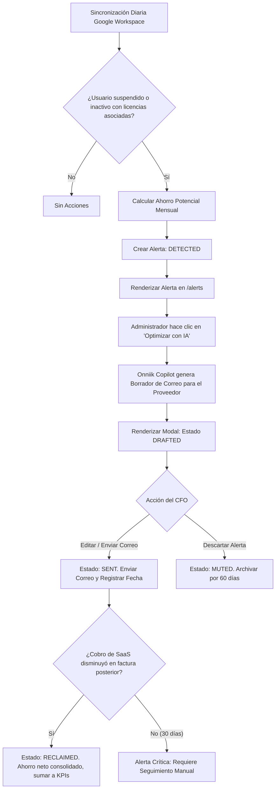

# Flujo de Usuario: Recuperación de Asientos Inactivos (Seat Reclamation)

Este documento especifica el flujo lógico de interacción, estados de optimización y diseño de interfaz para identificar y dar de baja licencias de software huérfanas o inactivas en Onniik, empleando el asistente de redacción con IA.

---

## 1. Diagrama de Flujo del Proceso

El flujo describe el análisis pasivo, la aprobación humana (HITL) y la verificación del ahorro real:



---

## 2. Estados Lógicos de la Alerta (`ReclamationStatus`)

El ciclo de vida de la optimización financiera de asientos se rastrea en el backend con las siguientes enumeraciones:
*   `DETECTED`: El sistema identificó una cuenta inactiva o suspendida en Google Workspace que tiene acceso registrado a una aplicación de pago.
*   `DRAFTED`: El administrador interactuó con la alerta y el Onniik Copilot estructuró el correo electrónico de reclamación/cancelación de la licencia.
*   `SENT`: El correo de solicitud de baja fue enviado al proveedor de software. El sistema entra en espera de confirmación de ajuste de facturación.
*   `RECLAIMED`: Éxito financiero. El sistema detectó la disminución del cobro en la factura del software del mes siguiente. El ahorro pasa a formar parte del cálculo del ROI y del Success Fee del periodo.
*   `MUTED`: Alerta archivada temporalmente por decisión del usuario (silenciada durante 60 días).

---

## 3. Lógica de Interacción y Redacción con IA (Human-in-the-loop)

La baja de licencias ineficientes no debe realizarse de forma autónoma para evitar errores operativos (ej. cancelar la cuenta de un socio clave que solo estuvo de vacaciones). Por ello, el flujo exige la intervención humana:

1.  **Detección**: En el panel de `/alerts`, el usuario ve una tarjeta que resume el ahorro: *"1 cuenta de ex-empleado activa en Jira. Ahorro potencial: $15 USD/mes"*.
2.  **Generación del borrador**: Al presionar `[ Optimizar con IA ]`, el sistema abre un modal Glassmorphism que previsualiza el correo de solicitud formal a Jira Support.
3.  **Aprobación**: El usuario puede modificar el texto del borrador (enriquecido por el contexto del cliente y la firma del administrador) y hacer clic en `[ Confirmar y Enviar ]`.

---

## 4. Wireframe Textual del Modal de Borrador (UI Onniik Copilot)

El modal se diseña bajo las directrices del estilo Glassmorphism y la tipografía base definida:

```
+-------------------------------------------------------------------------+
|  Onniik Copilot: Redacción de Solicitud de Baja                         |
|                                                                         |
|  Destinatario: support@atlassian.com                                    |
|  Asunto: Solicitud de baja de licencia inactiva - [Organización]         |
|                                                                         |
|  +-------------------------------------------------------------------+  |
|  | Estimado equipo de soporte de Atlassian,                          |  |
|  |                                                                   |  |
|  | Solicito la cancelación del asiento asignado a:                   |  |
|  | - ex_empleado@empresa.com                                         |  |
|  |                                                                   |  |
|  | Agradecemos procesar el ajuste de facturación proporcional para el |  |
|  | próximo ciclo mensual.                                            |  |
|  |                                                                   |  |
|  | Atentamente,                                                      |  |
|  | [Administrador] | CFO                                             |  |
|  +-------------------------------------------------------------------+  |
|                                                                         |
|        [ Confirmar y Enviar ]              [ Cancelar ]                 |
+-------------------------------------------------------------------------+
```

*   **Pila Tipográfica**: Entrada de texto y campos en fuente **Inter** (Regular, `--text-secondary`). Título del modal y botón de confirmación en fuente **Outfit** (Semi-bold, color `--accent-cyan` para botón primario).
*   **Envío**: Al confirmar, el sistema realiza el envío del correo y transiciona el registro al estado `SENT`, guardando el timestamp para auditar la respuesta del proveedor en el próximo escaneo de facturas.
